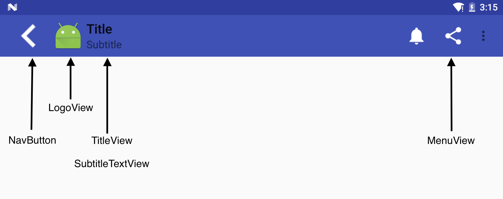

Toolbar作为ActionBar的完美替代品，具有低版本支持，高度自定义的特性。现在让我们了解下Toolbar的源码实现吧。

##特点
首先Toolbar继承于[ViewGroup](http://developer.android.com/intl/es/reference/android/view/ViewGroup.html)，可以像使用一个普通的View一样使用Toolbar，可以放在任何位置。
##重要的子View
- mMenuView、mTitleTextView、mSubtitleTextView、mNavButtonView、mLogoView

##自定义属性
```xml
<declare-styleable name="Toolbar">
        <attr name="titleTextAppearance" format="reference" />
        <attr name="subtitleTextAppearance" format="reference" />
        <attr name="title" />
        <attr name="subtitle" />
        <attr name="android:gravity" />
        <attr name="titleMargins" format="dimension" />
        <attr name="titleMarginStart" format="dimension" />
        <attr name="titleMarginEnd" format="dimension" />
        <attr name="titleMarginTop" format="dimension" />
        <attr name="titleMarginBottom" format="dimension" />
        <attr name="contentInsetStart" />
        <attr name="contentInsetEnd" />
        <attr name="contentInsetLeft" />
        <attr name="contentInsetRight" />
        <attr name="maxButtonHeight" format="dimension" />
        <attr name="collapseIcon" format="reference" />
        <attr name="collapseContentDescription" format="string" />
        <attr name="popupTheme" />
        <attr name="navigationIcon" format="reference" />
        <attr name="navigationContentDescription" format="string" />
        <attr name="android:minHeight" />
        <attr name="logo" />
        <attr name="logoDescription" format="string" />
        <attr name="titleTextColor" format="color" />
        <attr name="subtitleTextColor" format="color" />
</declare-styleable>
```
其中比较重要的是title、titleTextColor、navigationIcon
##重要的方法
作为一个ViewGroup，最重要的两个方法当然是onMeasure和onLyout方法。
###Measure方法
[onMeasure](https://gist.github.com/SeniorZhai/661dfba5f933d25f5c8732ca810a5e0f#file-measure)
可以看到源码中，分别对mNavButtonView、mCollapseButtonView、mMenuView、mExpandedActionView、mLogoView
```
    if (shouldLayout(mNavButtonView)) {
        measureChildConstrained(mNavButtonView, widthMeasureSpec, width, heightMeasureSpec, 0, mMaxButtonHeight);
        navWidth = mNavButtonView.getMeasuredWidth() + getHorizontalMargins(mNavButtonView);
        height = Math.max(height, mNavButtonView.getMeasuredHeight() + getVerticalMargins(mNavButtonView));
        // 合并子元素的测量状态
        childState = ViewUtils.combineMeasuredStates(childState, ViewCompat.getMeasuredState(mNavButtonView));
    }
```
###Layout方法
[onLayout](https://gist.github.com/SeniorZhai/661dfba5f933d25f5c8732ca810a5e0f#file-layout)
```

```